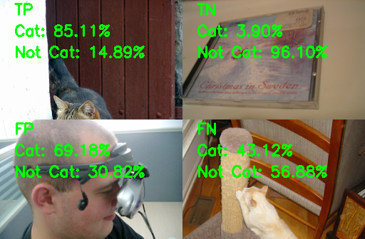
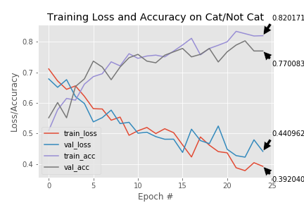
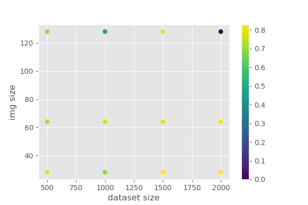
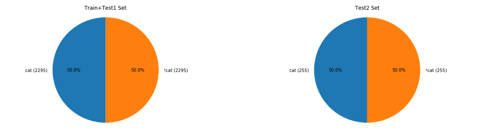
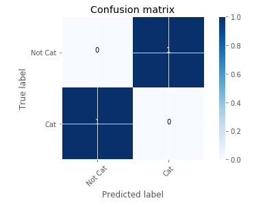
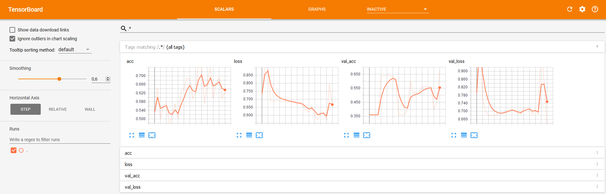
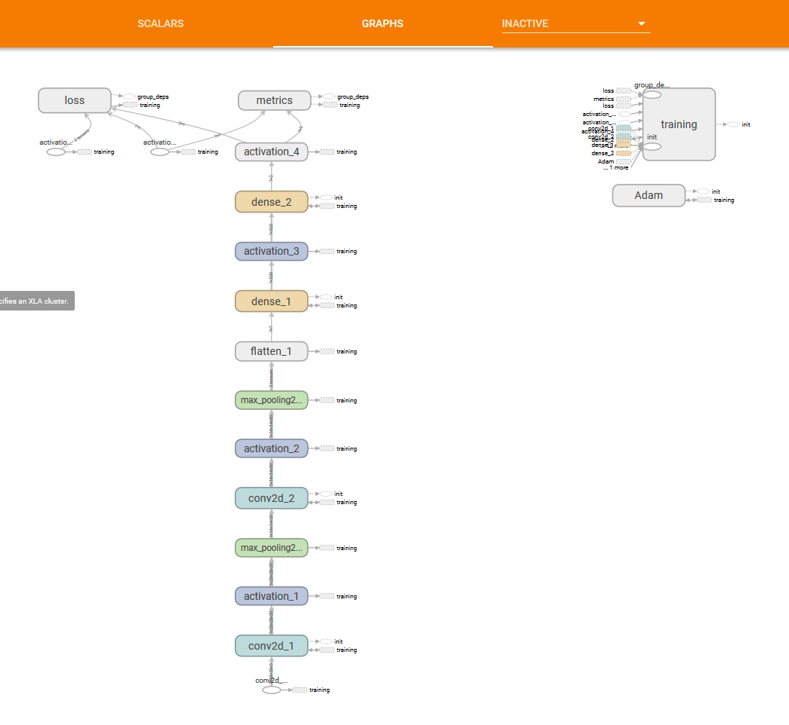

# IMAGE CLASSIFICATION

```sh
python -c "import keras; print(keras.__version__);"

# activate conda env
activate opencv

# train
python imgpred/train_network.py -d images/train -m models/cat_not_cat_04.model -p reporting/plot_04.png -w 64

# evaluate by hand
python imgpred/bulk_test_network.py -d images/test2 -m models/cat_not_cat_04.model -w 64

# visualize
tensorboard --logdir="./logs"
```

## Savoir si TF tourne sur CPU ou GPU
```py
import tensorflow as tf
# Creates a graph.
a = tf.constant([1.0, 2.0, 3.0, 4.0, 5.0, 6.0], shape=[2, 3], name='a')
b = tf.constant([1.0, 2.0, 3.0, 4.0, 5.0, 6.0], shape=[3, 2], name='b')
c = tf.matmul(a, b)
# Creates a session with log_device_placement set to True.
sess = tf.Session(config=tf.ConfigProto(log_device_placement=True))
# Runs the op.
print(sess.run(c))
```

## Python
* http://scikit-learn.org/stable/modules/generated/sklearn.model_selection.train_test_split.html
* http://scikit-learn.org/stable/modules/generated/sklearn.model_selection.GridSearchCV.html#sklearn.model_selection.GridSearchCV
* https://keras.io/getting-started/faq/#what-does-sample-batch-epoch-mean
* https://keras.io/models/model/#fit_generator
* https://keras.io/models/model/#fit

## Datasets

#### Cat

| Source | Total |
| --------------| -----------|
| [google image](https://www.google.com/search?q=cat&source=lnms&tbm=isch&sa=X&ved=0ahUKEwi8oKaNw5jYAhWG8RQKHVfoD7kQ_AUICigB&biw=1920&bih=968) | 610 |
| [imagenet](https://www.image-net.org/synset?wnid=n02121620) | 861 |
| [kaggle](https://www.kaggle.com/c/dogs-vs-cats/data) | 12500 |
| **total** | 13471 |

#### !Cat

| Source | Total |
| --------------| -----------|
| [Caltech101](http://www.vision.caltech.edu/Image_Datasets/Caltech101/) | 9145 |
| [ukbench](https://archive.org/details/ukbench) | 2550 |
| **total** | 11694 |

## Résultats

### LeNet

| N°| Res | Training Set Size (cat/not_cat) | Test Set Size (cat/not_cat) | Accuracy (train/val/eval) | Divers |
| --| ----| ------------------| --------------| ---------| -------|
| 1 | 28 | 637/637* | 144/530| \*/\*/0.66 | BS=25 EPOCHS=32 |
| 2 | 28 | 637/626 | 144/530 | \*/\*/0.75 ||
| 3 | 28 | 637/626 | 144/530 | \*/\*/0.77 | tensorflow gpu |
| 4 | 64 | 637/626 | 144/530| \*/\*/0.77 | tensorflow gpu |
| 5 | 28 | 361/361 | 361/361| \*/\*/0.79 ||
| 6 | 28 | 2295/2295 | 255/255 | \*/\*/0.87 |_|
| 7 | 28 | 4500/4500 | 500/500 | \*/0.864/0.88 | BS=25 EPOCHS=32 |
| 8 | 28 | 1000/1000 | 500/500 | 0.90/0.825/0.83 | BS=50 EPOCHS=80 |
| 9 | 28 | 4500/4500 | 500/500 | 0.92/0.86/0.88 | BS=50 EPOCHS=80 |
| 10 | 28 | 500/500 | 500/500 | 0.88/0.78/0.84 | BS=50 EPOCHS=80 |
| 11 | 28 | 500/500 | 500/500 | 0.888/0.808/0.83 | BS=50 EPOCHS=80 OPT='rmsprop' |

\* *(avec séries de 4 images similaires)*

### ConvNet

| N°| Res | Training Set Size (cat/not_cat) | Test Set Size (cat/not_cat) | Accuracy (train/val/test) | Divers |
| --| ----| ------------------| --------------| ---------| -------|
| 1 | 150 | 500/500 | 500/500 | 0.86/0.80/0.83 | BS=16 EPOCHS=50 OPT='rmsprop' |

## VIZ
* Exemples d'images rapportées à la matrice de confusion



* Progression de la performance au cours de l'apprentissage



* Résultats d'un grid search



* Stats sur le dataset



* Matrice de Confusion après test du classifieur (dataset test2)



* Tensorboard




## TO READ

* https://machinelearningmastery.com/grid-search-hyperparameters-deep-learning-models-python-keras/
* http://rdipietro.github.io/friendly-intro-to-cross-entropy-loss/
* http://cs231n.github.io/neural-networks-3/
* http://cs231n.github.io/understanding-cnn/
* https://hackernoon.com/visualizing-parts-of-convolutional-neural-networks-using-keras-and-cats-5cc01b214e59
